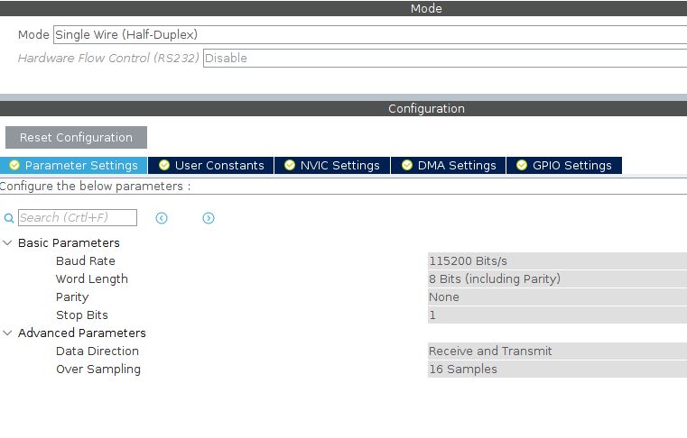
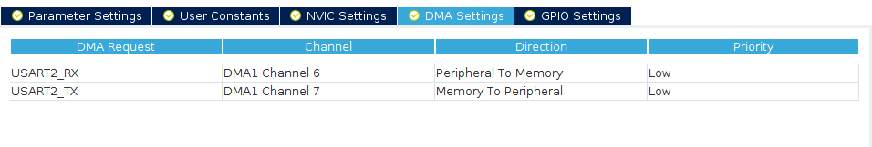
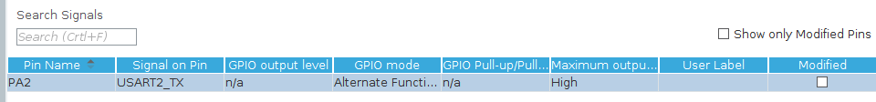
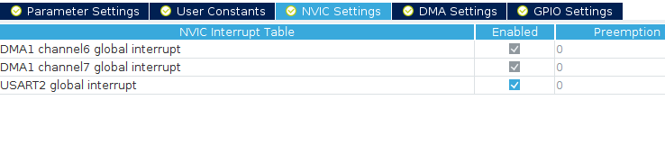

# DS18B20

## I found this code on the internet, it's not mine.

## connecting:

```
┌───────────────┐
│               │
│  FACING FLAT  │
│     SIDE      │
│               │
│  │    │    │  │
└──┼────┼────┼──┘
   │    │    │
   │    │    │
   │  ┌─┴─┐  │
   │  │   │  │
   │  │4K7│  │
   │  │   │  │
   │  └─┬─┘  │
   │    │    │
   │    │    │
  GND  3V3  3V3
```




